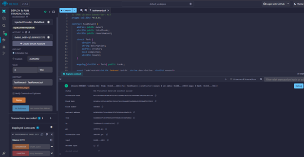
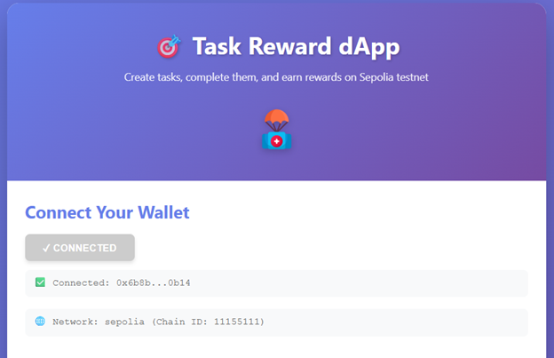
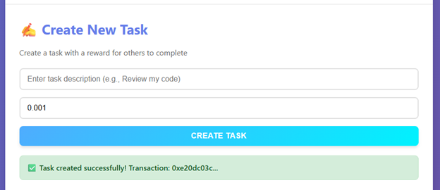
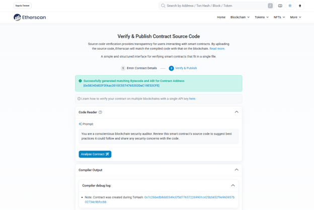

### Task Reward dApp - Blockchain Task Manager

A decentralized application built on Ethereum Sepolia testnet that allows users to create tasks with rewards and complete tasks to earn ETH.

---

### 🎯 Project Overview

This dApp enables users to:
- Create tasks with ETH rewards
- View task details on the blockchain
- Complete tasks created by others and claim rewards
- Track all tasks and contract balance in real-time

---

### 📋 Features

### Smart Contract Functions
- `createTask()` - Create a new task with reward (Write)
- `completeTask()` - Complete a task and claim reward (Write)
- `getTask()` - View task details (Read)
- `getTotalTasks()` - Get total number of tasks (Read)
- `getContractBalance()` - View contract ETH balance (Read)

### Frontend Features
- MetaMask wallet integration  
- Real-time contract data display  
- Responsive design with modern UI  
- Transaction status notifications  
- Network detection  

---

### 🛠️ Technology Stack

- **Blockchain:** Solidity 0.8.0, Ethereum Sepolia Testnet  
- **Frontend:** HTML5, CSS3, JavaScript (ES6+)  
- **Web3 Library:** ethers.js v5.7.2  
- **Wallet:** MetaMask  
- **IDE:** Remix IDE for contract deployment  

---

### 📦 Installation & Setup

**Prerequisites**
1. MetaMask browser extension installed  
2. Sepolia test ETH (get from [Sepolia Faucet](https://sepoliafaucet.com/))  
3. Modern web browser (Chrome, Firefox, Brave)  

   **Local Setup**

1. **Clone the repository:**
   ```bash
   git clone https://github.com/i235567-boop/TaskReward-dApp.git
   cd TaskReward-dApp


2. **Update Contract Address:**

   * Open `script.js`
   * Replace `YOUR_CONTRACT_ADDRESS_HERE` with the deployed contract address

3. **Run the Application:**

   * Simply open `index.html` in your browser
   * Or use a local server:

     ```bash
     python -m http.server 8000
     # Then visit http://localhost:8000
     ```

4. **Connect MetaMask:**

   * Make sure you're on Sepolia testnet
   * Click "Connect MetaMask" button
   * Approve the connection

---

### 📝 Smart Contract Details

**Contract Address:** `0x5824Dd02F3fAac2010C5574765202DeC19E52CFE`
**Deployed on:** Sepolia Testnet
**Verified on Etherscan:** [View Contract](https://sepolia.etherscan.io/address/0x5824Dd02F3fAac2010C5574765202DeC19E52CFE)

**Contract Functions**

| Function                | Type  | Description                             |
| ----------------------- | ----- | --------------------------------------- |
| `createTask(string)`    | Write | Create task with description and reward |
| `completeTask(uint256)` | Write | Complete task by ID and claim reward    |
| `getTask(uint256)`      | Read  | Get task details by ID                  |
| `getTotalTasks()`       | Read  | Get total number of tasks               |
| `getContractBalance()`  | Read  | Get contract's ETH balance              |

---

### 🎮 How to Use

**Creating a Task**

1. Connect your MetaMask wallet
2. Navigate to "Create New Task" section
3. Enter task description
4. Set reward amount (minimum 0.001 ETH)
5. Click "Create Task" and confirm transaction
6. Wait for confirmation

**Viewing a Task**

1. Enter task ID in "View Task Details" section
2. Click "View Task"
3. See all task information displayed

**Completing a Task**

1. Find an available task (not completed)
2. Enter task ID in "Complete Task" section
3. Click "Complete & Claim"
4. Confirm transaction in MetaMask
5. Receive reward in your wallet

---

### 📸 Screenshots

**1. Contract Deployment**



**2. MetaMask Connection**



**3. Transaction Success**



**4. Verified Contract (Bonus)**



---

### 🏗️ Project Structure

```
TaskReward-dApp/
├── index.html          # Main HTML file with UI structure
├── style.css           # Styling and responsive design
├── script.js           # JavaScript for Web3 interactions
├── TaskReward.sol      # Solidity smart contract
├── README.md           # Project documentation
└── screenshots/        # Application screenshots
    ├── 1-contract-deployment.png
    ├── 2-metamask-connection.png
    ├── 3-transaction-success.png
    └── 4-verified-contract.png
```

---

### 🔒 Security Considerations

* Contract uses `require` statements for input validation
* Prevents task creators from completing their own tasks
* Proper access control and state management
* Tested on Sepolia testnet before mainnet deployment

---

### 🚀 Future Enhancements

* Task categories and filtering
* Task expiration dates
* Rating system for task completers
* IPFS integration for task attachments
* Multi-reward token support

---

### 📚 Learning Resources

* [Solidity Documentation](https://docs.soliditylang.org/)
* [ethers.js Documentation](https://docs.ethers.io/)
* [MetaMask Documentation](https://docs.metamask.io/)
* [Remix IDE](https://remix.ethereum.org/)

---

### 👨‍💻 Developer

**Name:** Sumyyah Saeed
**Course:** Blockchain Technology for Business
**Institution:** FAST NUCES Islamabad
**Date:** 26 October 2025

---

### 📄 License

This project is licensed under the **MIT License**.

---

### 🙏 Acknowledgments

* Ethereum Foundation for Solidity
* MetaMask team for wallet integration
* Alchemy for Sepolia faucet
* Course instructors for guidance

---

**Note:**
This is a testnet application. Do not use on mainnet without proper auditing and testing.

---


